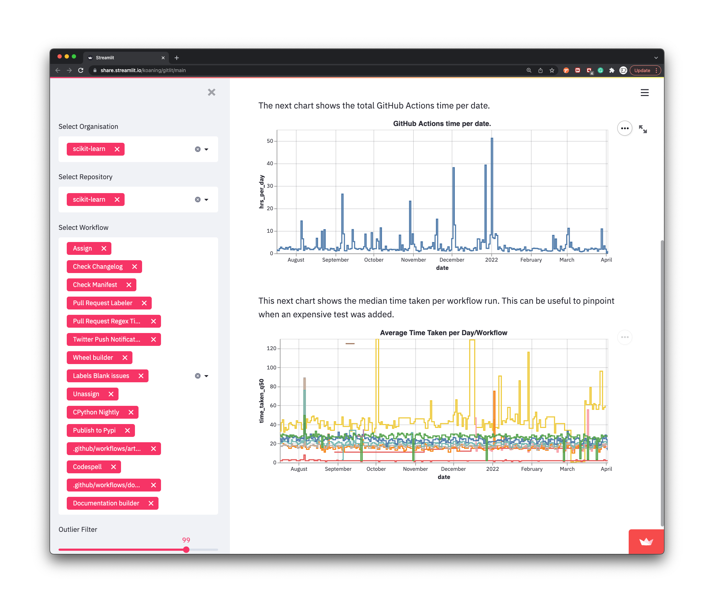

# gitlit

This repo contains the result of a scraper that scrapes the Github Actions runtimes from the Github API. The data is 
updated daily, assuming the cronjob doesn't face any bugs. 

The goal is to get a clear picture of the amount of compute is spent for CI for common open source packages. 
The hope is that we may learn from it and learn how to run code in a more lightweight fashion. 

## Explore 

The data is explorable via a streamlit app shown [here](https://share.streamlit.io/koaning/gitlit/main). 

## Feedback 

Feedback is certainly welcome. If you feel like packages are missing; feel free to start a discussion on the issues tracker. 
